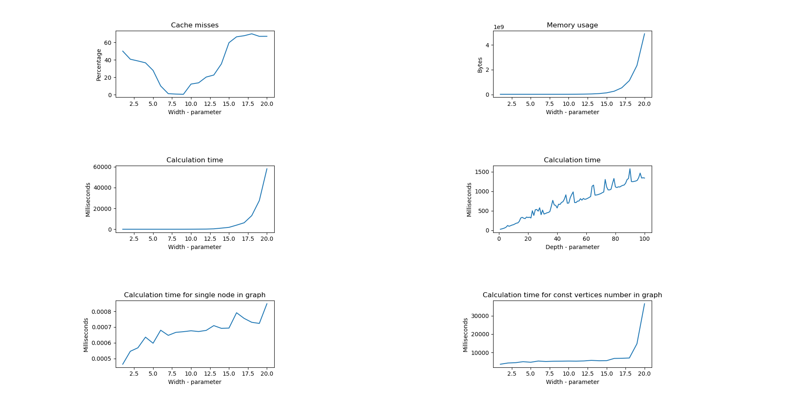

# RiffleScrambler

The project contains two versions ([Python](#python), [C++](#c)) of RiffleScrambler implemented during working on BSc Thesis.
Both versions slightly modify (optimize) original algorithms from the [paper](https://arxiv.org/pdf/1807.06443.pdf).


## C++

* [RiffleScrambler](#rifflescrambler-1) library satisfying requirements of [Password Hashing Competition](https://password-hashing.net/)
* [rs](#rs) command line interface
* [Tests](#tests)
* [Benchmarks](#benchmarks)

#### RiffleScrambler
C++ and C API for RiffleScrambler.
- [ ] TODO: translate [documentation](./mhf_riffle_scrambler_implementation_PL.pdf) and comments to english (BSc Thesis required it in polish).

#### `rs`
Command line interface for using RiffleScrambler.

Examples:
```
$ ./rs --help             
Password hashing memory-hard function
Usage:
RiffleScrambler  Password is read from stdin [OPTION...] [optional args]

-s, --salt arg   Salt for the given password
-w, --width arg  Width of the graph (default: 12)
-d, --depth arg  Number of stacks of the graph (default: 2)
-f, --func arg   Internal hash function (default: sha256)
-h, --help       Print help
```

```
$ echo -n "password" | ./rs somesalt -w 16 -d 2 -f sha224
Graph width:    16
Graph depth:    2
Hash:           166c88a5edfba7228fbf49a4bcd4cb2f01cc5fcdc850bf78c317a5c8
Encoded:        $g=16$d=2$s=c29tZXNhbHQ=$f=sha224$h=MTY2Yzg4YTVlZGZiYTcyM(...)
```

#### Tests
Using [Catch2](https://github.com/catchorg/Catch2).

#### Benchmarks
Testing RiffleScrambler times and memory statistics for different parameters.


## Python

* [RiffleScrambler](#rifflescrambler-1) library
* [rs](#rs) command line interface

#### RiffleScrambler
Implementation in Python3.7.

#### `rs`
Simple CLI.


```
$ ./rs.py --help                 
usage: rs.py [-h] [--width WIDTH] [--depth DEPTH] Password Salt

Riffle Scrambler
positional arguments:
  Password              Password to hash
  Salt                  Salt for the given password
optional arguments:
  -h, --help            show this help message and exit
  --width WIDTH, -w WIDTH
                        Width of the graph
  --depth DEPTH, -d DEPTH
                        How many time graph should be stacked
```

```
$ ./rs.py passwd salt1 -w 12 -d 2
8d867f84b8ad158de4fbad8c0da5d66cba4ac207
```

